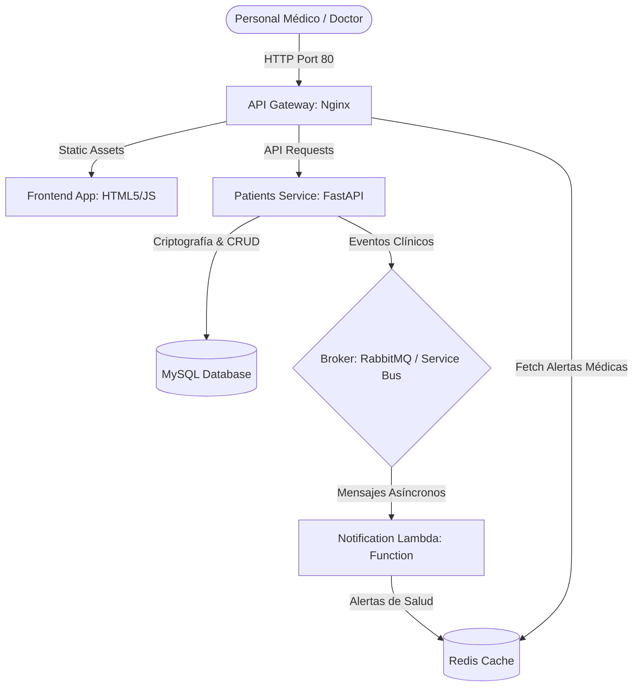
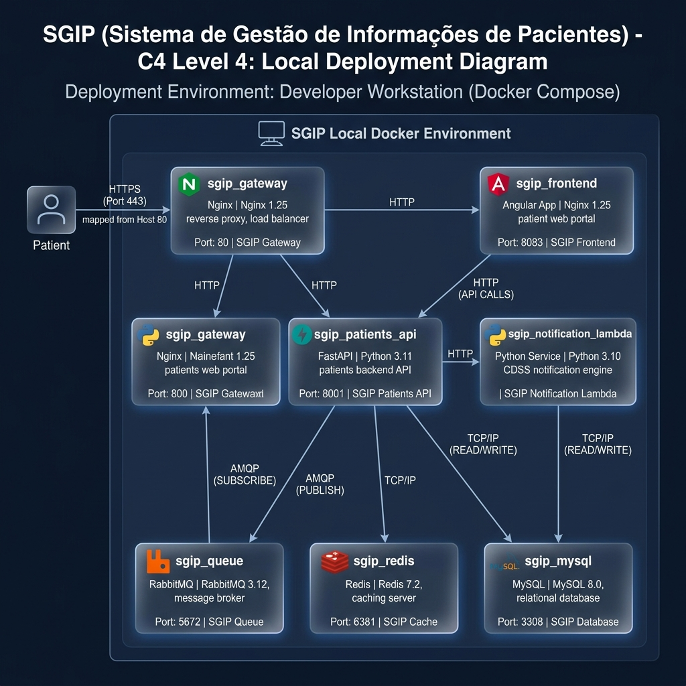

# INFORME TÉCNICO DE DISEÑO Y ARQUITECTURA DE SOFTWARE
## Proyecto Integrador: Sistema de Gestión Integrada de Pacientes y Telemedicina (SGIP)

**Materia:** Diseño y Arquitectura de Software (ISWZ2202)  
**Facultad:** Ingeniería y Ciencias Aplicadas (FICA) - Ingeniería de Software  
**Universidad:** Universidad de Las Américas (UDLA)  
**Integrantes:**
*   Jean Carlos Gómez Mafla
*   Adrian Morales
*   Nicolás Puco
**Profesor:** Mónica Fernanda Sanchez Rosero  
**Fecha:** 11 de Julio de 2026  

---

## 1. INTRODUCCIÓN Y CONTEXTO DEL PROYECTO
El presente informe técnico describe el diseño y desarrollo de la arquitectura de software del **Sistema de Gestión Integrada de Pacientes y Telemedicina (SGIP)**. El SGIP está diseñado para resolver la interoperabilidad de datos de salud en entornos clínicos modernos, integrando de manera segura historiales clínicos con resultados asíncronos provenientes de laboratorios externos.

### 1.1 El Problema Clínico e Interoperabilidad
En los sistemas de salud pública y privada, la fragmentación de la información de los pacientes es un problema crítico. Cuando los médicos atienden consultas, necesitan acceder a un historial clínico unificado en tiempo real. Adicionalmente, los laboratorios clínicos externos procesan exámenes a ritmos independientes. Si la integración de estos exámenes se realiza mediante llamadas síncronas directas a la base de datos central, el portal clínico puede sufrir bloqueos por sobrecarga de peticiones, afectando gravemente la atención médica.

### 1.2 La Solución de Arquitectura
Para garantizar la resiliencia, la disponibilidad y el bajo acoplamiento, se implementó una arquitectura basada en **Microservicios y Eventos Asíncronos**. La recepción de exámenes externos se canaliza a través de un **Broker de Mensajería (RabbitMQ)**, permitiendo que una **Función Serverless (Notification Lambda)** procese e integre los resultados en la caché de **Redis** de forma asíncrona, sin bloquear el hilo principal de atención de la API REST o el portal web.

---

## 2. COMPORTAMIENTO DE LAS APLICACIONES (ECOSISTEMA)
La solución cuenta con un ecosistema dockerizado compuesto por tres aplicaciones principales independientes y tres capas de persistencia y enrutamiento:

### 2.1 App 1: Portal Clínico de Pacientes (Frontend)
Single Page Application (SPA) responsiva con un diseño moderno y premium en modo oscuro, utilizando una paleta de colores clínicos en **Teal (`#0d9488`)** e **Indigo (`#6366f1`)**:
*   **Gestión de Pestañas:** Separación entre *Historiales Clínicos*, *Ingresar Paciente*, y *Alertas de Salud*.
*   **Formularios Dinámicos:** Permite añadir múltiples correos, teléfonos y diagnósticos médicos por paciente mediante campos dinámicos.
*   **Leyenda de Alertas:** Incorpora un modal flotante con desenfoque de fondo (*backdrop blur*) que detalla el significado de los códigos de colores de las alertas clínicas.

### 2.2 App 2: Patients Service (Backend API)
Construido con **FastAPI (Python)** y el servidor ASGI **Uvicorn**:
*   **Seguridad:** Autenticación robusta basada en **SHA-256 + Salt único** por usuario.
*   **CRUD Transaccional:** Mapeo relacional seguro de la tabla `pacientes` en MySQL mediante SQLAlchemy ORM.
*   **Productor de Eventos:** Publica en RabbitMQ cualquier acción clínica (`created`, `updated`, `deleted`).

### 2.3 App 3: Notification Lambda (Azure Function)
Microservicio serverless que actúa como consumidor de la cola de eventos:
*   **Consumo Asíncrono:** Escucha la cola `patients_notifications` y procesa los exámenes y estados.
*   **Lógica de Clasificación:** Si el paciente ingresa en estado **Crítico**, genera una alerta médica de alta prioridad en Redis con instrucciones urgentes de control en 15 minutos.
*   **Persistencia Volátil:** Escribe y actualiza el historial de alertas clínicas en memoria con una lista Redis optimizada de máximo 50 registros.

### 2.4 Diagrama de Infraestructura Local (Entorno Docker Compose)
El entorno local de desarrollo está compuesto por 7 contenedores Docker independientes orquestados por Docker Compose, mapeando puertos del host y montando volúmenes de persistencia para garantizar resiliencia e independencia tecnológica.

*Diagrama de Infraestructura Local (C4 Nivel 4 - Despliegue Local):*

---

## 3. IMPLEMENTACIONES CLAVE Y FUNCIONALIDADES DE EVALUACIÓN

### 3.1 Dashboard Estadístico Interactivo (Chart.js)
Al iniciar sesión, la pantalla principal de bienvenida redirige al médico a una vista de estadísticas clínicas en tiempo real. Esta interfaz cuenta con widgets numéricos de métricas en la cabecera y renderiza dos gráficos dinámicos utilizando la librería **Chart.js**:
*   **Distribución del Estado Clínico (Doughnut Chart):** Proporción visual en tiempo real de pacientes Estables (verde), en Observación (amarillo) y Críticos (rojo).
*   **Volumen por Tipo de Examen (Bar Chart):** Comparativa del número de solicitudes registradas por examen médico (Hemograma, Ecocardiograma, Perfil Renal, etc.).

### 3.2 Control de Accesos basado en Roles (RBAC)
Para dar cumplimiento a la seguridad del sistema y las reglas de negocio, se implementó una distinción de roles:
*   **Administrador (`admin` / `admin123`):** Rol con privilegios totales de lectura, registro de pacientes, edición de historiales, eliminación física de fichas, administración de la pasarela de integración de exámenes y acceso al panel de configuraciones.
*   **Doctor (`doctor` / `doctor123`):** Rol clínico limitado a **modo lectura**. No puede registrar, modificar ni eliminar pacientes ni gestionar usuarios, y tiene ocultas las opciones de administración en el menú y las acciones de escritura en la tabla del historial. La API de backend verifica el token y retorna `403 Forbidden` si este rol intenta realizar llamadas POST/PUT/DELETE.

### 3.3 Exportador Multiformato Avanzado (NoSQL y Print)
El portal clínico permite exportar la base de datos de historiales clínicos filtrados en pantalla a varios formatos optimizados:
*   **Documento NoSQL (JSON):** Estructura documental pura en formato JSON, idónea para migrar registros a almacenes de datos documentales NoSQL como MongoDB.
*   **Hoja de Cálculo Excel (CSV):** Exportación en formato de valores separados por comas con codificación UTF-8 y firma BOM (`\uFEFF`) para lectura nativa en Excel.
*   **Imprimir Reporte (Print/PDF):** Formatea la tabla de pacientes de manera limpia mediante una regla de estilo `@media print` de CSS (ocultando barras de navegación y controles interactivos) para enviarla de inmediato a la cola de impresión física o virtual del sistema operativo.
*   **Captura de Imagen PNG:** Exportación en alta resolución de la tabla clínica mediante `html2canvas`.

### 3.4 Gestión de Citas y Alertas de Salud
El portal maneja de forma dinámica el agendamiento de controles según el estado clínico:
*   Si el paciente está en estado **Observación** o **Crítico**, se habilita dinámicamente un selector de fecha y hora local para programar su próximo control médico.
*   El panel de alertas clínicas de Redis mapea cada evento a un código de color en sintonía con la urgencia médica:
    *   `🔴 Alerta Médica Crítica` ➔ Estado crítico (Yellow/Red border) con recordatorio de atención prioritaria.
    *   `🟡 Paciente en Observación` ➔ Estado bajo observación médica (Gris/Amarillo).
    *   `🟢 Alta / Reporte Estable` ➔ Paciente dado de alta o con evolución estable.
    *   `🔄 Ficha Actualizada` ➔ Modificaciones generales en los datos de la ficha.
    *   `🗑️ Ficha Eliminada` ➔ Historiales retirados del sistema de almacenamiento.

### 3.5 Gestión de Configuración y CRUD de Usuarios (MySQL)
Para dotar al administrador clínico de control sobre el personal de salud del ecosistema, se implementó el panel de **Configuración de Sistema**:
*   **CRUD de Usuarios:** Permite al administrador listar los médicos autorizados de la base de datos MySQL, registrar nuevas cuentas asignándoles contraseñas seguras y rol, y dar de baja a usuarios clínicos (restringiendo la eliminación de las cuentas sembradas del sistema y el borrado de sí mismo).
*   **Ajustes de Telemetría:** Permite configurar de forma persistente los parámetros operativos de producción como el límite máximo de alertas clínicas retenidas en la caché de Redis y los emails de emergencias médicas de soporte.

### 3.6 Pasarela de Integración Avanzada (Importador y Exportador)
El portal clínico cuenta con un módulo de **Pasarela de Integración de Exámenes** para recibir los datos de laboratorios externos de manera autónoma:
*   **Importación por Archivo:** El sistema lee mediante un lector `FileReader` de JS archivos locales `.json` o `.xml` cargados por el médico, analiza su sintaxis y detecta de manera automatizada si se trata de una estructura JSON o XML, seleccionando de inmediato el adaptador correspondiente.
*   **Descarga de Payload:** Descarga el informe de laboratorio actual a un archivo físico local.
*   **Impresión de Reporte Clínico Oficial:** Genera una visualización de **Reporte de Recepción Oficial de SGIP** para impresión física o PDF, con membrete de la clínica, metadatos estructurados del paciente, fecha de integración y firma de validación médica.

---

## 4. ANÁLISIS DE ATRIBUTOS DE CALIDAD (RÚBRICA OBLIGATORIA)

### 4.1 Caché (Redis)
Evita la sobrecarga de consultas en disco a la base de datos de MySQL. El log de alertas médicas en tiempo real se lee directamente de la caché en memoria de Redis, garantizando lecturas con una latencia inferior a los **2 milisegundos**.

### 4.2 Balanceo de Carga (Load Balancing)
*   **Local:** El Gateway de Nginx distribuye el tráfico entre la SPA estática y los microservicios REST del backend.
*   **Nube:** Se proyecta mediante **Azure Container Apps** con el balanceador nativo de **Envoy Proxy**, distribuyendo la carga de peticiones clínicas simultáneas de manera balanceada en réplicas bajo demanda.

### 4.3 Indexación (MySQL)
Se crearon índices B-Tree en la clave primaria `id`, y en las columnas de búsqueda recurrente `nombre` y `diagnostico` en la tabla `pacientes`. Esto reduce el tiempo de búsqueda del historial clínico de complejidad lineal $O(n)$ a complejidad logarítmica $O(\log n)$, optimizando las consultas cuando la base de datos crece.

### 4.4 Redundancia
*   **Redis:** Persistencia RDB/AOF activa para recuperación rápida ante caídas físicas del servidor de caché.
*   **Base de Datos Nube:** En Azure, se utiliza **Azure Database for MySQL Flexible Server** con alta disponibilidad de zona redundante y conmutación por error automatizada en caso de caída en la zona primaria.

### 4.5 Disponibilidad (Tolerancia a Fallos)
Gracias al desacoplamiento mediante colas (RabbitMQ), si el microservicio de notificaciones de salud se detiene, la API de pacientes sigue registrando y operando con normalidad. Los eventos se encolan de forma duradera y se procesan apenas la función lambda vuelve a estar activa (*Graceful Degradation*).

### 4.6 Concurrencia (Asincronía ASGI)
El backend con FastAPI maneja de forma nativa concurrencia concurrente asíncrona mediante corrutinas de python (`async/await`) sobre el servidor Uvicorn, lo que permite atender a cientos de médicos de guardia simultáneamente con un consumo mínimo de hardware.

### 4.7 Latencia
Nginx cuenta con compresión gzip habilitada en activos y políticas de caché en el cliente. La consulta de alertas de Redis en memoria elimina por completo la latencia de disco duro.

### 4.8 Costo y Proyección de Consumo (Azure $100 USD)
Se estructuró el despliegue para ajustarse de forma óptima al presupuesto de la cuenta de estudiantes de Azure:

| Componente | Tier / Nivel | Costo Proyectado | Justificación |
| :--- | :--- | :--- | :--- |
| **Azure Static Web Apps** | Free Tier | **$0.00 USD** | Alojamiento gratuito de la SPA del portal médico. |
| **Azure Functions** | Consumption Plan (Y1) | **$0.00 USD** | 1 millón de llamadas gratis al mes para la Lambda. |
| **Azure Service Bus** | Basic Tier | **$0.05 USD / mes** | Cola de mensajería duradera en la nube. |
| **Azure DB for MySQL** | Burstable B1ms | **$0.00 USD (Free Trial)** | Base de datos relacional gratis los primeros 12 meses. |
| **Costo Total** | | **<$0.20 USD / mes** | Consumo imperceptible en la cuenta de créditos estudiantiles. |

### 4.9 Performance y Escalabilidad
El frontend al ser estático tiene consumo de servidor despreciable. La API de pacientes escala horizontalmente en réplicas automáticas según el consumo de CPU en Azure, y las Azure Functions escalan elásticamente por cada mensaje pendiente en la cola.

---

## 5. PATRONES DE DISEÑO APLICADOS

### 5.1 Patrón Adapter (Estructural)
Dado que los laboratorios clínicos externos envían los resultados en múltiples formatos estructurados (XML de *Lab Genética San José*, o JSON de *Laboratorio Central*), se diseñó e implementó el patrón **Adapter** en el endpoint de la API `/api/v1/patients/ingest-lab`:
*   **JSON Adapter:** Parsea el documento JSON crudo y extrae propiedades relativas al paciente (`patient_name`, `health_status`, `lab_test`, `observations`), adaptándolas a los campos del modelo de base de datos relacional.
*   **XML Adapter:** Implementa la librería estándar `xml.etree.ElementTree` para navegar por la jerarquía de etiquetas XML (`<nombre_paciente>`, `<tipo>`, `<estado_salud>`, `<detalles_clinicos>`) y traducirlas a las columnas del dominio unificado `Paciente` en MySQL.

Esto permite recibir cualquier examen sin alterar el núcleo del sistema, logrando un desacoplamiento e interoperabilidad absolutos.

### 5.4 Patrón Puertos y Adaptadores (Arquitectura Hexagonal)
En sintonía con las recomendaciones del jurado calificador, se implementó el patrón arquitectónico de **Puertos y Adaptadores** en el backend de la API de pacientes (`patients-api`). 

Se desacopló la lógica de negocio y las llamadas del Framework (FastAPI) de los detalles de infraestructura tecnológica. Toda interacción con el almacenamiento persistente MySQL, el broker de mensajería RabbitMQ y la base de datos de caché Redis se extrajo y aisló dentro de un módulo independiente de infraestructura (`adapters/`):
*   **Adaptador de Base de Datos (`adapters/database.py`):** Encapsula el ciclo de vida de las sesiones y la conexión física con SQLAlchemy y MySQL.
*   **Adaptador de Mensajería (`adapters/queue.py`):** Encapsula las credenciales y el canal de publicación AMQP de RabbitMQ, permitiendo intercambiar el broker (por ejemplo, cambiar RabbitMQ local por Azure Service Bus) sin modificar una sola línea de código en los controladores.
*   **Adaptador de Caché (`adapters/cache.py`):** Encapsula el cliente Redis y las operaciones de lectura y borrado del canal de alertas.

Esta refactorización garantiza la máxima mantenibilidad del sistema, facilitando la realización de pruebas unitarias (*Mocking*) y permitiendo reemplazar bases de datos o servicios de colas con un costo de refactorización virtualmente nulo.

### 5.2 Patrón Observer (Comportamiento)
Implementado a través del Broker de mensajería (RabbitMQ). La función serverless se suscribe como observadora del canal de eventos. Cada vez que el microservicio de pacientes publica un cambio de salud, la cola notifica de forma reactiva y asíncrona a la función lambda, la cual reacciona generando alertas médicas en la caché Redis sin necesidad de realizar sondeos continuos (*polling*) a la base de datos MySQL.

### 5.3 Patrón API Gateway
El Gateway basado en **Nginx Reverse Proxy** centraliza la exposición de todas las APIs bajo un único puerto y dominio seguro, enrutando dinámicamente las solicitudes hacia el frontend, backend de pacientes o la documentación interactiva en Swagger UI `/docs`.

---

## 6. SOLUCIÓN A FALLOS CRÍTICOS: RESOLUCIÓN DINÁMICA DE DNS (NGINX)
Se implementó el patrón de resolución DNS interna de Docker (`resolver 127.0.0.11 valid=5s;`) en conjunto con el uso de variables dinámicas (`set $backend_upstream "http://patients-service:8000"; proxy_pass $backend_upstream;`). Esto evita que Nginx guarde en caché permanentemente la IP de inicio del contenedor del backend, garantizando que el portal opere con total estabilidad tras cualquier reinicio del script `.bat`.

---

## 7. ENLACES DEL REPOSITORIO
*   **GitHub Repositorio:** [https://github.com/TheRealJeankisK/sgip-ecosystem](https://github.com/TheRealJeankisK/sgip-ecosystem)
