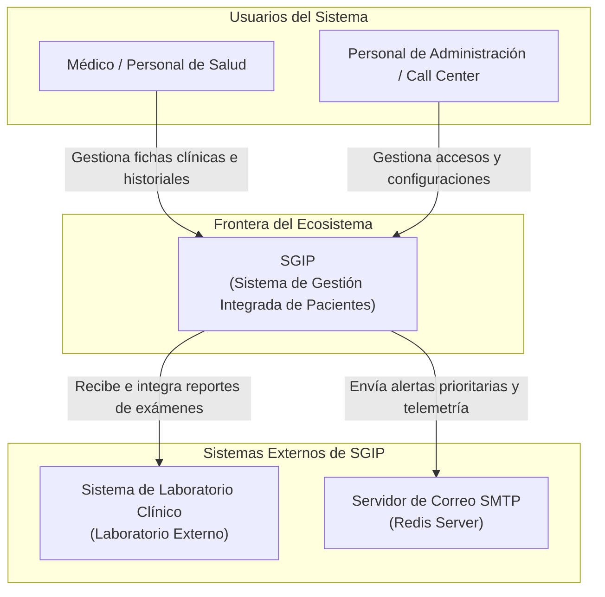
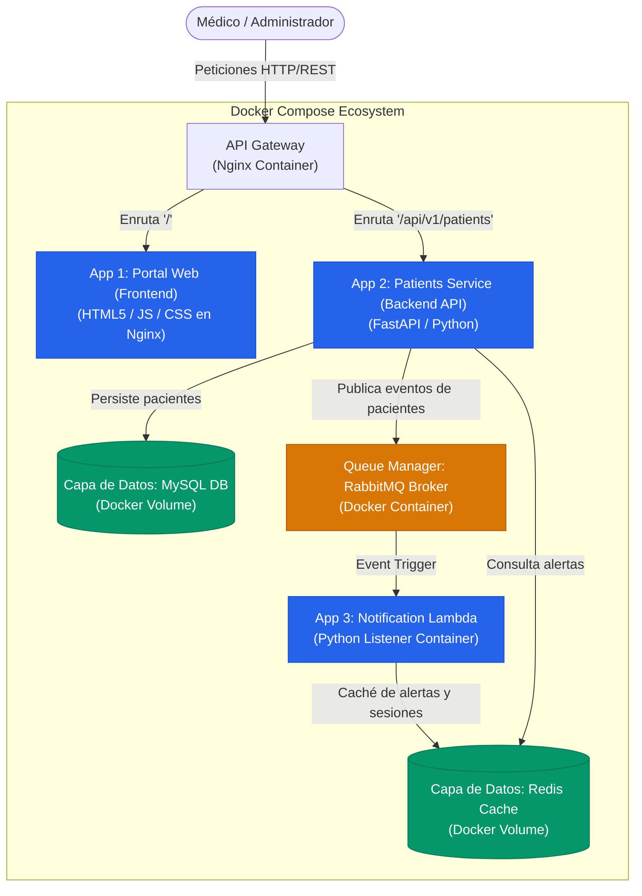
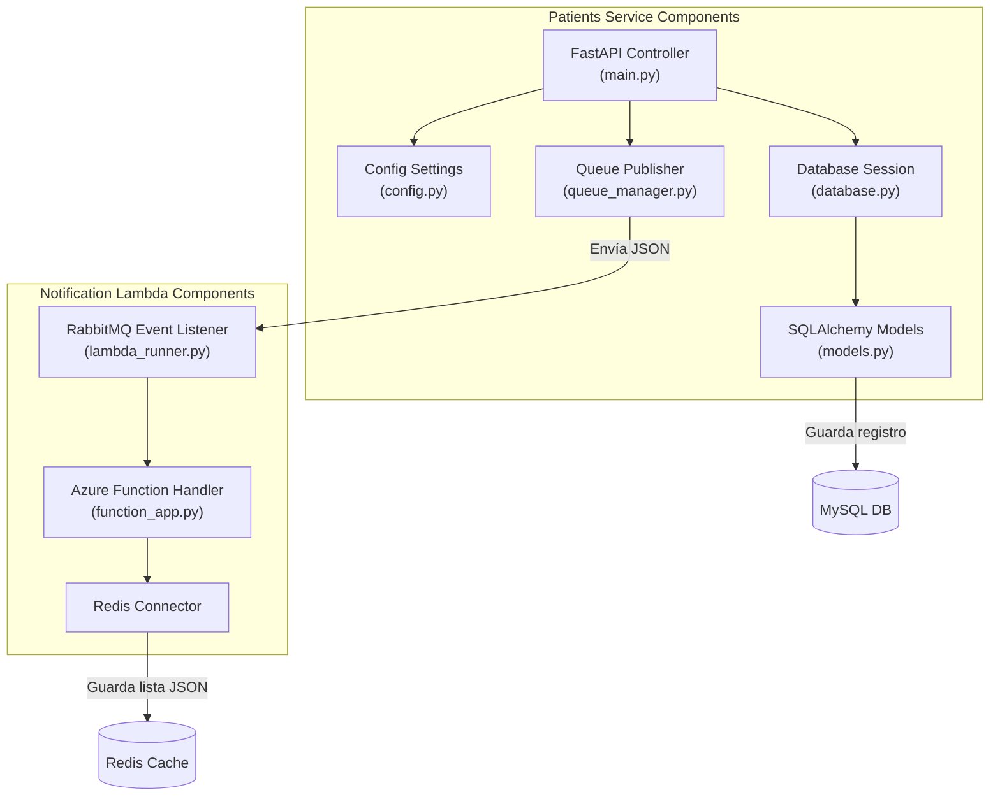
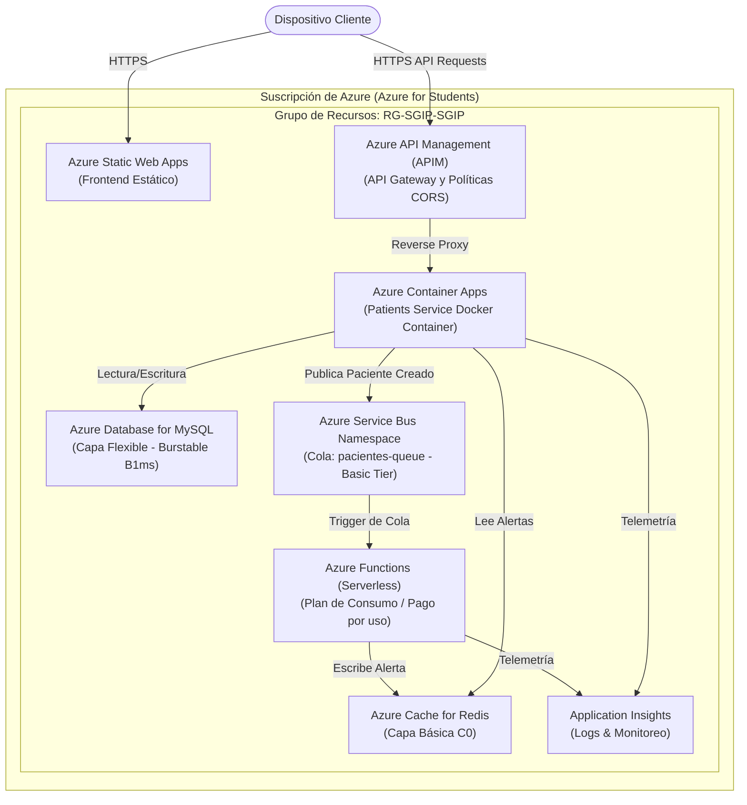

# Documentación de Arquitectura y Modelo C4 - SGIP

**Materia:** Diseño y Arquitectura de Software (ISWZ2202)  
**Proyecto:** Sistema de Gestión Integrada de Pacientes (SGIP)  
**Entregable:** Documentación Técnica de Arquitectura (C4, Infraestructura y Despliegue)  

---

## 1. Modelo C4 - Diagramas de Arquitectura

El Modelo C4 divide la arquitectura del software en diferentes niveles de abstracción (Contexto, Contenedores, Componentes y Código). A continuación se presentan los tres primeros niveles detallados en sintaxis **Mermaid.js**.

### 1.1. Nivel 1: Diagrama de Contexto del Sistema
Muestra cómo el sistema **SGIP** se sitúa dentro de la organización, interactuando con los usuarios y los sistemas externos.

*Diagrama de Contexto visualizado en Structurizr:*

---

### 1.2. Nivel 2: Diagrama de Contenedores (Arquitectura Física)
Muestra los contenedores en ejecución (servicios API, frontend, bases de datos y colas de mensajería) desplegados mediante Docker Compose.

*Diagrama de Contenedores visualizado en Structurizr:*

---

### 1.3. Nivel 3: Diagrama de Componentes
Detalle de la arquitectura interna de los microservicios **Patients Service** y **Notification Lambda**.

*Diagramas de Componentes visualizados en Structurizr:*

---

## 2. Diagrama de Despliegue en la Nube (Azure Production)

Este diagrama representa la topología de red física y lógica en la nube de **Microsoft Azure**, utilizando el crédito estudiantil y aprovechando servicios completamente administrados de bajo consumo.

*Diagrama de Despliegue en la Nube visualizado en Structurizr:*

---

### Protocolos de Comunicación Utilizados
1. **Cliente ➔ Frontend**: HTTPS (Puerto 443).
2. **Cliente ➔ API Gateway (APIM)**: HTTPS REST (Puerto 443).
3. **API Gateway ➔ Patients Service**: HTTP REST interno.
4. **Patients Service ➔ MySQL**: Protocolo nativo de MySQL sobre TCP/IP (Puerto 3306).
5. **Patients Service ➔ Service Bus**: AMQP sobre WebSockets (Puerto 5671/443).
6. **Service Bus ➔ Azure Function**: Disparador por polling interno (AMQP).
7. **Azure Function ➔ Redis**: Protocolo RESP de Redis seguro (TLS Puerto 6380).

---

## 3. Modelo C4 en Código (Structurizr DSL)

Para cumplir con el estándar formal de la metodología **C4 Model in Code** y facilitar su renderización en herramientas como **Structurizr CLI** o **IcePanel**, se ha definido la arquitectura completa del SGIP en el archivo estructurado [workspace.dsl](file:///C:/Users/jeanc/Desktop/Arquitectura%20de%20Software/A_ABET%20Proyecto%20Integrador/medical/docs/workspace.dsl).

Este archivo utiliza el lenguaje DSL oficial de Structurizr para modelar de forma jerárquica los actores (Personas), contenedores (Containers), subcomponentes (Components) y las relaciones de red del ecosistema clínico. Puede ser importado directamente en cualquier visor compatible con Structurizr para generar los diagramas interactivos automáticamente.

